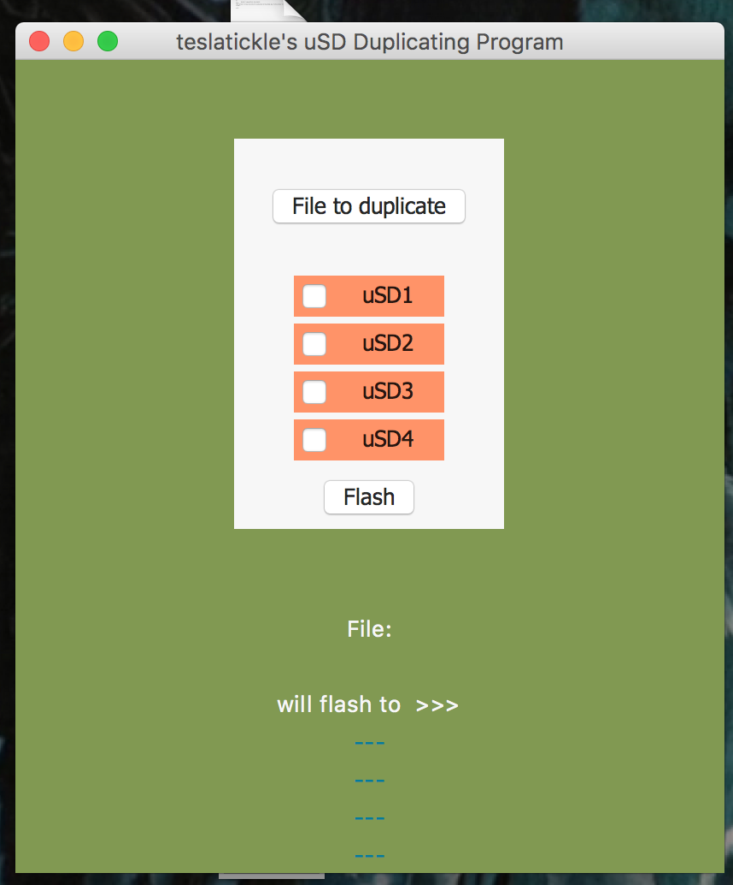
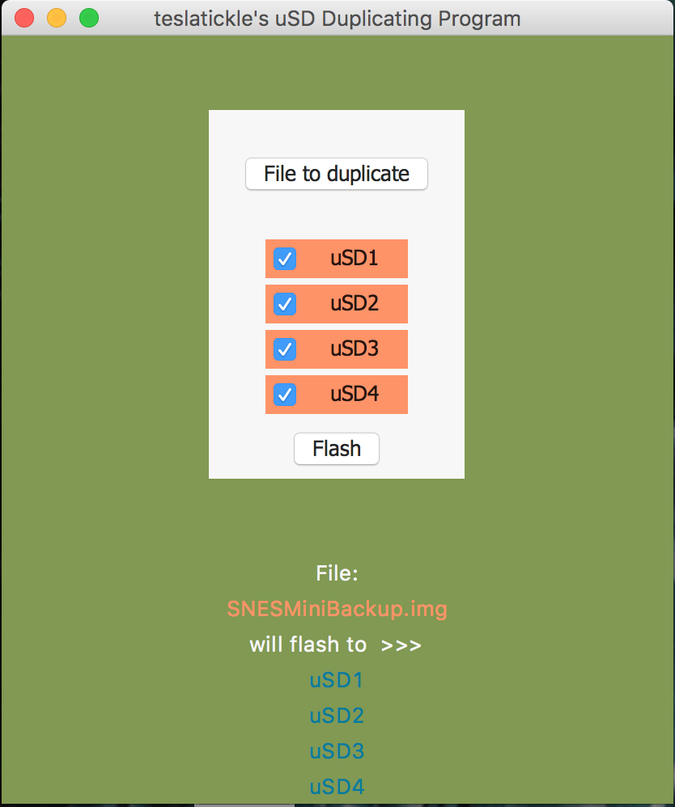
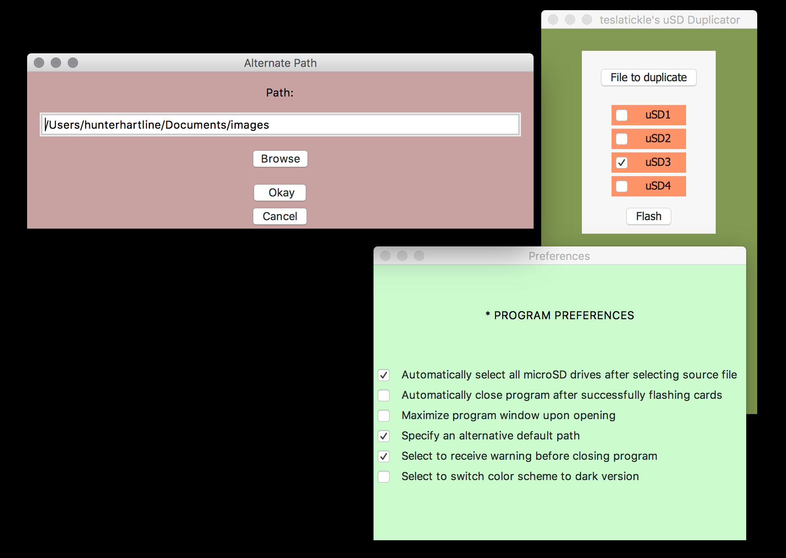

# Micro SD Duplicator (Python, tKinter)                                                                                                                                                                                                                 

## dcfldd.GUI_Python
Python + tkinter + dcfldd with multi-threading and subprocess modules. In an attempt to save my girlfriend and myself time in flashing copious amounts of uSD cards, I've began writing this python script to handle the commands to bash and allow for quicker and more accessible experience.

    

  
